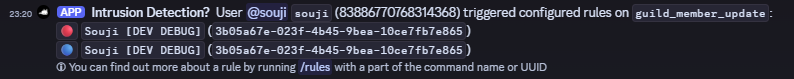

# Application Details

This bot is an essential part of our moderation flow in the discord.js community (/djs) and it requires privileged intents to do what it needs to do to ensure safety protocols and server moderation.

It evaluates the raw data received from raw gateway events against a set of pre-defined rules and alerts server staff if a match is found, supporting better awareness and informing manual moderation actions.

This is used as an intrusion detection system protecting members from common scams and data patterns we observe across the platform.

- It does not store any data off-platform
- It does not store any data
- It just processes data on-the-fly
- It does not profile users
- It does not associate data points to track relationships

Its entire source code is available at https://github.com/almostSouji/discord-sigma

## Do you have a Privacy Policy?

Yes.

### Where is your Privacy Policy available?

It's linked in an ephemeral /privacy slash command response.

### Share a link to your Privacy Poliocy.

https://github.com/almostSouji/discord-sigma/blob/main/PRIVACY.md

## Privileged Intents

- [x] Server Members Intent
- [x] Presence Intent
- [x] Message Content Intent

# Server Members Intent
## Why do you need the Guild Member intent?

The app alerts moderators about suspicious members joining or being present in the server.
It does so by matching the raw received event structure from GUILD_MEMBER_ADD and GUILD_MEMBER_UPDATE events.

Rules could for example be based on creation date, name patterns, known user ids, or anything else the raw payload can be matched against.
The privileged Guild Member intent is required to do so.

There is no native alternative for monitoring and informing in a similar fashion at scale.
Opting out is not possible, since this is a safety feature.

## Please provide screenshots/videos that demonstrate your use case

## Are you storing API data off-platform?

No.

# Presence Intent
## Why do you need the Guild Presences intent?

The app alerts for matching presences (we have encountered threat actors that boast about being part of spam groups, extortion circles, and other groups in their activity)
The privileged Guild Presences intent is required to receive activity data in order to match it against rules of commonly observed or known campaign details/names/patterns.

Date does not get stored, profiled, or otherwise enriched to endanger user privacy.
The data is evaluated against presence rules and alerts are sent accordingly, if matches are found.

There is no native alternative to monitor for threat groups this way in a similar fashion at scale.
Opting out is not possible, since this is a safety feature.

## Please provide screenshots/videos that demonstrate your use case

## Can users opt-out of having their Presence data tracked

No.

## Are you storing API data off-platform?

No.

# Message Content Intent
## Can users opt-out of having their message content data tracked?

No.

## Are you storing API data off-platform?

No.

## Will the message content data be used to train machine learning or AI Models?

No.

## Why do you need the Message Content intent?

The primary matching factor for message-based rules is message content.
This cannot be implemented in discord-native automod, since the omega rule language offers much deeper, conditional matching on both the message content as well as the message author.

- Example1: `message matches <pattern> AND message author joined discord before <date> AND message author joined discord after <date>`
- Example2: `message matches <pattern> OR (author name matches <pattern> AND author joined discord after <date> AND message matches <pattern2>)`
- Example3: `message has attachment with filename <pattern>` (can also again be combined with other message or author conditions)
- Example4: `message references a message in channel <channel_id>` (can also again be combined with other message or author conditions)

\* Examples are written so they are hopefully undertandable. In omega-notation this would be complex to understand but possible.

This allows us to severely limit false positive alerts by narrowing actionable instances down to the account creation range we expect from a given malicious campaign.
Expressions can become quite complicated but in doing so result in far fewer false positives than using discord native automod for alerts.
Additionally, this allows us to match against fields other than just message content, as explained above.

Opting out is not possible, since this is a safety feature.

## Please provide screenshots/videos that demonstrate your use case

